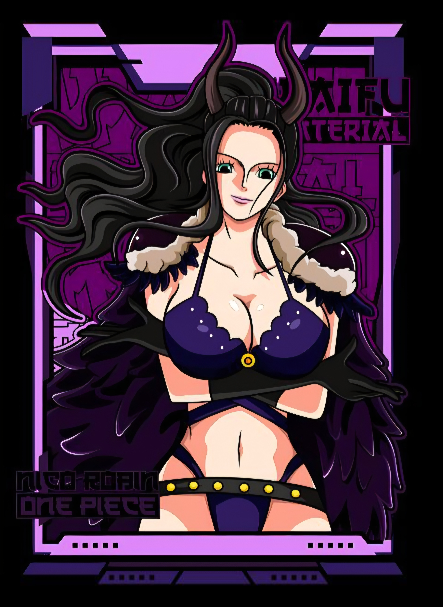

# 🌸 Niko Robin Discord Bot



**A private, single-guild Discord bot built with Node.js & discord.js v14**
*Ticket system • Welcome system • Auto-roles • Dashboard • Render ready*

[](https://nodejs.org)
[](https://discord.js.org)
[](https://render.com)
[](LICENSE)

---

## ✨ Features

### 🎟 Ticket System
- **`/ticket` Slash Command:** Posts a ticket panel in any channel.
- **Private Channels:** Keeps conversations isolated between users and staff.
- **Interactive Buttons:** Quick "Claim" and "Close" UI for server staff.
- **Auto-Categories:** Automatically creates and organizes ticket categories.

### 👋 Welcome & 🚪 Leave Systems
- **Welcome Embeds:** Greets new members with a customized image embed in your welcome channel.
- **Auto-Roles:** Automatically assigns the member role upon joining.
- **Leave Embeds:** Sends a goodbye message when a user departs.

### 🎛 Web Dashboard
A clean web panel for configuring ticket roles dynamically — no code changes needed.
- Select which roles can **create** tickets.
- Select which roles can **claim** tickets.
- Live ticket stats (total, open, closed).

### ⚡ Utility
- **`/ping` Command:** Displays API latency, Bot latency, and a custom banner image.
- **Private Guild Design:** Built to operate within a single guild only.

---

## 🛠 Tech Stack
- **Node.js** (v18+)
- **discord.js** (v14)
- **Express** (Web Dashboard)
- **Render** (Cloud hosting — free tier compatible)

---

## 🗂 Project Structure

```
NIKOrobin/
├── assets/
│   ├── banner.jpg       ← Used in /ping and ticket embeds
│   ├── welcome.jpg      ← Used in welcome embeds
│   ├── leave.jpg        ← Used in leave embeds
│   └── logo.jpg         ← Bot/dashboard logo
├── commands/
│   ├── ping.js          ← /ping command
│   └── ticket.js        ← /ticket command
├── public/
│   ├── index.html       ← Dashboard UI
│   └── dashboard.js     ← Dashboard frontend logic
├── .env.example         ← Copy to .env and fill in
├── .gitignore
├── config.json          ← Channel & role IDs
├── index.js             ← Main bot entry point
├── package.json
├── render.yaml          ← Render deployment config
└── README.md
```

---

## 🚀 Setup & Deployment

### 1. Prerequisites
- Node.js v18+
- A Discord bot with these Privileged Intents enabled:
  - **Server Members Intent**
  - **Message Content Intent**

### 2. Local Development

```bash
# Clone the repo
git clone https://github.com/KazutoZ02/NIKOrobin.git
cd NIKOrobin

# Install dependencies
npm install

# Copy and fill in your .env
cp .env.example .env
```

Edit `.env`:
```env
TOKEN=your_bot_token
CLIENT_ID=your_application_id
GUILD_ID=your_server_id
PORT=3000
```

```bash
# Start the bot
npm start
```

### 3. Render Deployment (Free Tier)

1. Push this repo to GitHub.
2. Go to [render.com](https://render.com) → New → Web Service.
3. Connect your GitHub repository.
4. Render auto-detects `render.yaml`. Set your environment variables:
   - `TOKEN`
   - `CLIENT_ID`
   - `GUILD_ID`
5. Deploy! The bot will start and register slash commands automatically.

> **Render Free Tier Note:** Free services spin down after inactivity. The `/health` endpoint keeps the bot alive when pinged by an uptime monitor (e.g. UptimeRobot).

---

## ⚙️ Configuration

### Channel & Role IDs (`config.json`)
| Key | ID | Purpose |
|---|---|---|
| `channels.welcome` | `1472931536461365289` | Welcome messages |
| `channels.leave` | `1472933955652030642` | Leave messages |
| `roles.bot` | `1472935152421306603` | Bot/staff role |
| `roles.users` | `1472934932966932490` | Member auto-role |

### Dashboard
Access the web dashboard at your Render URL (or `http://localhost:3000` locally).
Use it to configure which roles can create and claim tickets without editing code.

---

## 📋 Slash Commands

| Command | Description |
|---|---|
| `/ping` | Shows bot and API latency with banner |
| `/ticket` | Posts a ticket panel with Open button |

---

## 🔒 Bot Permissions Required
- `Manage Channels` — Create ticket channels
- `Manage Roles` — Assign auto-role
- `Send Messages` — Send embeds
- `Embed Links` — Rich embed support
- `Attach Files` — Image embeds
- `Read Message History`
- `View Channels`

---

*Made with 💗 by KazutoZ02*
